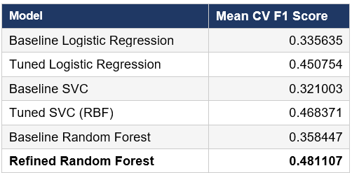
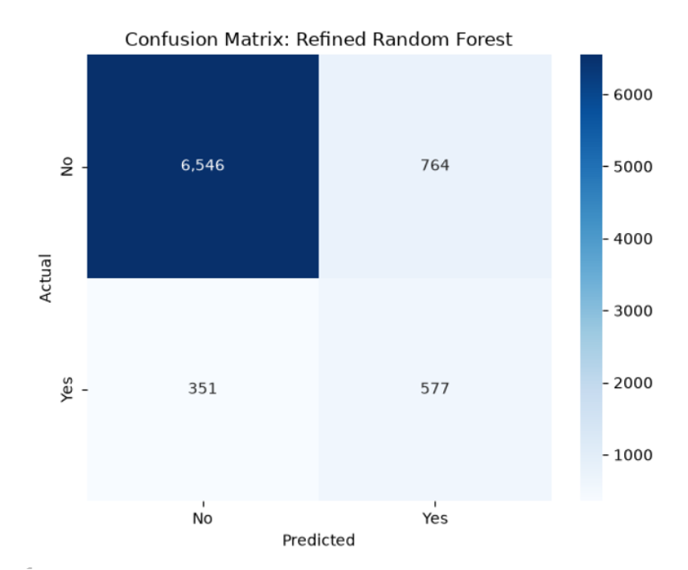

# Term Deposit Subscription Prediction

**Machine Learning Classification Project using the UCI Bank Marketing Dataset**

*CFG +Masters // AI & ML Project*

This is my first solo machine learning project, completed as part of the CFG +Masters programme.
  
## Project Overview
Telephone marketing campaigns can be costly and may have low response rates when customers are contacted without effective targeting. This project investigates how machine learning classification can be used to predict whether a customer is likely to subscribe to a term deposit following a telephone marketing campaign.  

Using the UCI Bank Marketing dataset, three classification models: Logistic Regression, Support Vector Classifier (SVC), and Random Forest, were developed and compared. The models were evaluated and improved through cross-validation, class weighting, and hyperparameter tuning, with the aim of identifying a model that could support more targeted marketing decisions.  

## Dataset

The project uses the **Bank Marketing dataset** from the UCI Machine Learning Repository.

- **Dataset:** `bank-additional-full.csv`
- **Records:** 41,188
- **Variables:** 21 (20 input variables and 1 target variable)
- **Target variable:** `y` - whether the customer subscribed to a term deposit (`yes` or `no`)
- **Campaign type:** Telephone-based direct marketing campaigns conducted by a Portuguese banking institution
- **Dataset source:** [UCI Machine Learning Repository | Bank Marketing](https://archive.ics.uci.edu/dataset/222/bank+marketing)

The dataset includes customer characteristics, campaign-related information, previous campaign outcomes, and macroeconomic variables.

The dataset represents **telephone-based marketing campaigns** and does not include other marketing channels such as email, mobile applications, or online banking. Therefore, this project is limited to predicting term deposit subscription following telephone marketing campaigns.
 
  
## Project Workflow

1. **Data Preparation**

   - Split the dataset into training and test sets before preprocessing to prevent data leakage.
   - Investigated missing values, duplicate records, class imbalance, and variable distributions.
   - Applied imputation and one-hot encoding to categorical variables.

2. **Exploratory Data Analysis**

   - Analysed numerical and categorical variables to understand their distributions and relationships with term deposit subscription.
   - Investigated outliers and correlations between numerical variables.
   - Identified a significant class imbalance in the target variable.

3. **Feature Engineering and Scaling**

   - Converted `pdays` into a binary `pcontacted` feature to represent whether a customer had been contacted in a previous campaign.
   - Applied RobustScaler to numerical variables to reduce the influence of extreme values.

4. **Model Development**

   - Developed three classification models: Logistic Regression, SVC, and Random Forest.
   - Established baseline performance using 5-fold cross-validation and F1 score.

5. **Hyperparameter Tuning**

   - Tuned the models using GridSearchCV and manual experimentation.
   - Used class weighting to address the imbalanced target variable.
   - Compared tuned models using their mean cross-validation F1 scores.

6. **Final Model Evaluation**

   - Selected the Refined Random Forest based on the highest mean cross-validation F1 score.
   - Evaluated the selected model once on the untouched test dataset using precision, recall, F1 score, accuracy, and a confusion matrix.  

## Model Selection

Three classification algorithms were evaluated: **Logistic Regression, Support Vector Classifier (SVC), and Random Forest**. Due to the class imbalance in the target variable, **F1 score for the subscribed class** was used as the main evaluation metric.  
  
Model performance was assessed using **5-fold cross-validation**, and each baseline model was compared with its final tuned version.  

  

All three models achieved higher mean cross-validation F1 scores after tuning. The **Refined Random Forest achieved the highest mean CV F1 score of 0.4811** and was therefore selected as the final model for evaluation on the unseen test dataset.

## Final Model Performance

The **Refined Random Forest** was evaluated on the unseen test dataset to assess its performance on new data.

* **Accuracy:** 86.5%
* **Precision (Subscribed):** 0.430
* **Recall (Subscribed):** 0.622
* **F1 Score (Subscribed):** 0.509
* **Actual subscribers identified:** 577 out of 928 (62.2%)

  

Although the overall accuracy was 86.5%, the subscribed-class metrics provide a more meaningful evaluation because of the class imbalance. The model identified **62.2% of actual subscribers**, but the precision of **0.430** indicates that a considerable number of customers predicted as subscribers did not subscribe.  
  
While the model demonstrated some ability to identify potential subscribers, its performance for the subscribed class remains limited and further improvement would be required before it could be considered effective for practical marketing decisions.  

## Key Findings

- The target variable was **highly imbalanced**, with approximately 11% of customers subscribing to a term deposit. This made accuracy alone less suitable for evaluating model performance and increased the importance of F1 score, precision, and recall.

- Previous campaign information showed useful patterns in customer subscription behaviour. In particular, customers with a **successful outcome from a previous marketing campaign** showed a higher likelihood of subscribing.

- Several **macroeconomic variables were strongly correlated**, including employment-related indicators and Euribor rates. These variables were retained in the current project, but their impact could be investigated further through feature selection.

- **All three classification models improved after tuning**, demonstrating the value of hyperparameter tuning and class weighting for this imbalanced classification problem.

- The **Refined Random Forest performed best among the models tested**, although its final performance showed that accurately identifying potential subscribers remains challenging and that further model development is required.

## Limitations and Future Improvements

The final model demonstrated some ability to identify potential subscribers, but its performance for the subscribed class remained limited. Several areas could be explored to improve the project further:

- **Class imbalance:** Class weighting was used in the current project. Future experimentation could investigate alternative techniques such as SMOTE to determine whether resampling improves the identification of subscribers.

- **Machine learning pipeline:** A pipeline could be developed to combine preprocessing, resampling, and model training within the cross-validation process, creating a more systematic workflow and reducing the risk of data leakage.

- **Feature selection:** Several macroeconomic variables showed strong correlations. Future experiments could compare model performance with and without selected correlated features to investigate whether feature reduction improves performance.

- **One-hot encoding:** All categories were retained during one-hot encoding. Future experimentation could investigate the effect of dropping a reference category, particularly for Logistic Regression.

- **Further model optimisation:** Additional models, wider hyperparameter searches, and decision-threshold tuning could be explored to improve the balance between precision and recall.

I plan to continue developing this project by experimenting with these approaches and evaluating whether they improve the model's ability to identify potential subscribers.
  
## Dataset License

The Bank Marketing dataset is licensed under the **Creative Commons Attribution 4.0 International (CC BY 4.0)** license, which permits sharing and adaptation with appropriate attribution.

**Dataset citation:** S. Moro, P. Rita, & P. Cortez (2014). *Bank Marketing* [Dataset]. UCI Machine Learning Repository. DOI: 10.24432/C5K306.

[Creative Commons Attribution 4.0 International](https://creativecommons.org/licenses/by/4.0/)  